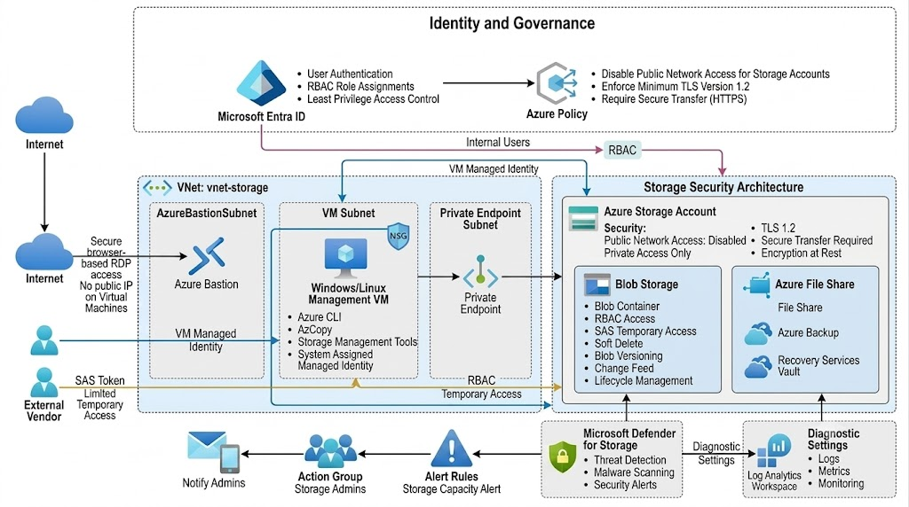

# Azure Enterprise Secure Storage Platform

> A production-style Azure Storage project demonstrating secure storage architecture using Microsoft Azure networking, identity, monitoring, governance, and security best practices.

---

## 📖 Project Overview

The **Azure Enterprise Secure Storage Platform** is a production-style cloud project designed to demonstrate how to build, secure, monitor, and govern an enterprise Azure Storage environment using Microsoft Azure services and security best practices.

The project focuses on implementing a **private, identity-based storage architecture** that eliminates public exposure while providing secure administrative access, centralized monitoring, backup and recovery, governance, and threat protection.

Instead of deploying a basic Storage Account, this project simulates how an enterprise organization would design and secure critical business data in Azure.

---

## 🎯 Project Objectives

* Design a secure enterprise Azure Storage architecture.
* Eliminate public access using Azure Private Endpoint.
* Implement identity-based authorization with Microsoft Entra ID and Azure RBAC.
* Secure administrative access through Azure Bastion.
* Protect business data using backup and recovery features.
* Monitor storage activity with Azure Monitor and Log Analytics.
* Detect threats using Microsoft Defender for Storage.
* Enforce governance through Azure Policy and Resource Locks.
* Demonstrate Azure security best practices aligned with the AZ-104 certification.

---

## 🏢 Business Scenario

A company needs a secure cloud storage platform to host business documents and application data.

The solution must:

* Prevent direct public access to storage resources.
* Allow administrators to securely manage storage resources.
* Protect data against accidental deletion.
* Provide temporary, secure access for external users.
* Continuously monitor storage usage and activities.
* Detect suspicious or malicious behavior.
* Enforce organizational security policies.
* Support backup and recovery for critical data.

This project implements a secure Azure solution that satisfies all of these requirements.

---

## 🏗️ Solution Architecture

The solution is built using the following Azure services:

* Microsoft Entra ID
* Azure Storage Account
* Azure Blob Storage
* Azure File Share
* Azure Virtual Network (VNet)
* Azure Bastion
* Azure Virtual Machine
* Azure Private Endpoint
* Azure Private DNS Zone
* Azure RBAC
* Managed Identity
* Azure Backup
* Recovery Services Vault
* Azure Monitor
* Log Analytics Workspace
* Microsoft Defender for Storage
* Azure Policy
* Azure Resource Lock
